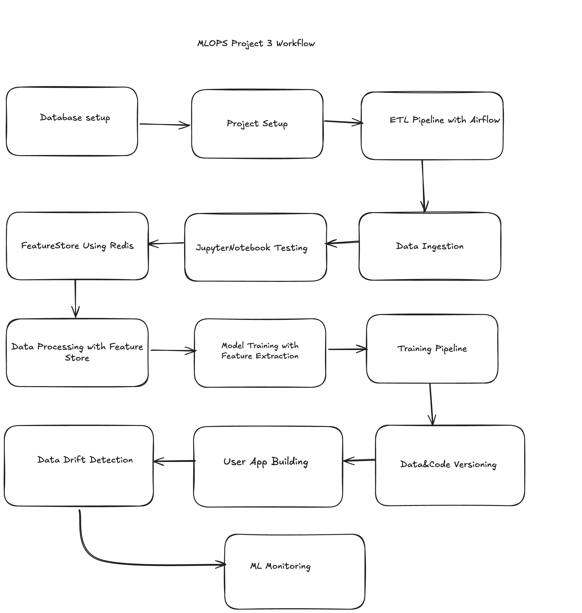

# 🚢 MLOps Project 3: Titanic Survival Prediction

This project is part of the MLOps Project Series and focuses on implementing **data engineering**, **feature stores**, and **ML monitoring** concepts using a well-known dataset: the Titanic Survival dataset.

While the machine learning task is familiar, the emphasis of this project is on integrating key MLOps components in a realistic workflow.

---

---

## 🎯 Objective

To predict passenger survival using the Titanic dataset and to integrate advanced MLOps practices such as:

- ETL pipelines using **Airflow (Astronomer)**
- Feature Store using **Redis**
- ML monitoring with **Prometheus** and **Grafana**
- Data Drift Detection using **EvidentlyAI** or **LeviDetect**

---

## 🧱 Project Highlights

### ✅ ETL Pipeline with Airflow
- Build Extract-Transform-Load pipelines using **Astronomer Airflow**
- Extract Titanic CSV data from GCP buckets (simulated)
- Transform it into table-compatible formats
- Load into **PostgreSQL**

### ✅ Feature Store with Redis
- Store processed features (X_train, Y_train, etc.)
- Avoid repeated transformations and improve scalability
- Use Redis CLI/Docker for feature store setup

### ✅ Data Drift Detection
- Compare incoming data with training reference data
- Use **LeviDetect** or **EvidentlyAI** to track and alert on drift

### ✅ ML Monitoring with Prometheus & Grafana
- Define custom metrics: prediction count, data drift count, mean of age, etc.
- Visualize them in real-time dashboards using Grafana
- Automate alerts (e.g., trigger retraining if drift > threshold)

---

## 🔄 Workflow Breakdown

1. **Database Setup**: Simulated cloud storage using GCP buckets and PostgreSQL
2. **Project Setup**: Virtual env, folder structure, `setup.py`, `requirements.txt`
3. **ETL Pipeline**: Astronomer Airflow to extract-transform-load data into PostgreSQL
4. **Data Ingestion**: Read from PostgreSQL, save to CSV, split into train/test
5. **Jupyter Notebook Testing**: EDA, feature engineering, baseline model
6. **Feature Store**: Push clean features to Redis; later pull for model training
7. **Data Processing & Feature Extraction**: Modular pipeline code using `src/`
8. **Model Training**: Train classifier using features pulled from Redis
9. **Training Pipeline**: Combine data ingestion, processing, and training into one script
10. **Versioning**: Use GitHub for both code and small dataset versioning
11. **User App (Flask)**: Build web app for input/output; stylize with HTML + ChatGPT-generated CSS
12. **Data Drift Detection**: Compare live inputs with training data
13. **ML Monitoring**: Use Prometheus to log metrics; Grafana for dashboards

---

## 📁 Dataset

- **Source**: [Kaggle - Titanic Survival Dataset](https://www.kaggle.com/competitions/titanic/data)
- **Fields**: Name, Age, Pclass, SibSp, Cabin, Embarked, etc.
- **Target**: `Survived` (0 = No, 1 = Yes)

---

## 🛠️ Tools & Libraries

| Category          | Tools / Libraries              |
|-------------------|--------------------------------|
| ML & EDA          | Pandas, Scikit-learn, Matplotlib |
| ETL               | Apache Airflow (Astronomer)    |
| Feature Store     | Redis (via Docker)             |
| Monitoring        | Prometheus, Grafana            |
| Drift Detection   | LeviDetect / EvidentlyAI       |
| Web Framework     | Flask + HTML/CSS               |
| Versioning        | GitHub                         |
| Database          | PostgreSQL                     |

---

## 💡 Why Titanic Dataset?

This dataset is widely understood and avoids the need to spend time on:
- Understanding new feature spaces
- Complex model architecture
- Unknown preprocessing techniques

This allows full focus on mastering **ETL pipelines**, **Feature Store**, and **Monitoring**, which are **crucial in real-world production systems**.

---

## 📌 Key MVPs (Milestones)

1. **ETL Pipeline with Airflow**
2. **Redis-based Feature Store**
3. **Data Drift Detection**
4. **ML Monitoring with Grafana + Prometheus**

